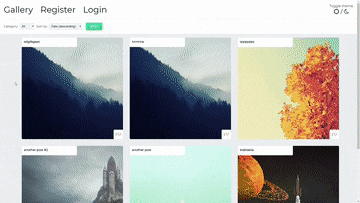
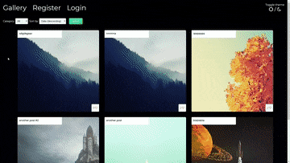

# Image gallery

> Built using PHP and MySQL

## Prerequisites

LAMP environment, e.g. [XAMPP](https://www.apachefriends.org).

## Project setup

### Database setup

1. Create a database by running the SQL code in the `schema.sql` file located in the project root directory.
2. Update the PDO connection configuration string in `connection.php` with name of the database, database user and password.

## Running the app

Start Apache and MySQL. If you are using the XAMPP this can be done in the XAMPP Control Panel.
